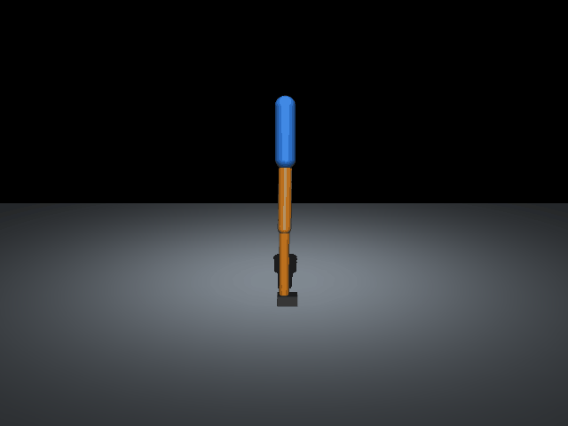

# Robot Leg Balance

A simulated planar (2D) robot leg (ankle, knee, hip and torso) that learns to stay
upright and reject pushes. It uses [MuJoCo](https://mujoco.org/) and
[Gymnasium](https://gymnasium.farama.org/) for the simulation and
[Stable-Baselines3](https://stable-baselines3.readthedocs.io/) (PPO) for reinforcement learning.



Full video: [media/leg_balance.mp4](media/leg_balance.mp4)

## Setup
```bash
python3 -m venv .venv && source .venv/bin/activate
pip install "gymnasium[mujoco]" stable-baselines3 matplotlib imageio imageio-ffmpeg tensorboard
```

## Files
- `leg.xml`: MuJoCo model with foot, shank, thigh, torso and three position-controlled joints.
- `view_leg.py`, `push_test.py`: live viewer and a hand-tuned PD standing baseline.
- `leg_env.py`: Gymnasium environment. The policy outputs small corrections on top of the
  PD baseline. The reward favours staying upright, flat-footed and still, and random pushes
  hit the torso during training.
- `train.py`, `finetune.py`: PPO training, with the maximum push force as a curriculum knob.
- `eval_policy.py`: largest single push a policy survives (3 seeds per force level).
- `watch_policy.py`: live viewer of a trained policy. You can push it with the mouse.
- `record_policy.py`: renders a policy to mp4.
- `models/`: trained policies.

## Results
Largest single 0.1 s push on the torso survived, followed by 9 s of recovery (`eval_policy.py`):

| Model | Trained push range | Forward | Backward |
|---|---|---|---|
| PD baseline (no learning) | none | 10 N | 0 N |
| `models/ppo_leg_push40.zip` | up to 40 N | 40 N | 50 N |
| `models/ppo_leg_push70.zip` | up to 70 N, fine-tuned from push40 | 60 N | 60 N |

```bash
python eval_policy.py models/ppo_leg_push70
python watch_policy.py models/ppo_leg_push70
```

## Notes
Early versions defined "fallen" by torso height alone. That misfired on valid crouch
recoveries and stopped the policy from learning them. Switching to a torso-tilt
threshold (`|pitch| > 0.8 rad`, or a genuine collapse) fixed it. The first training
attempt with pushes up to 100 N also failed to learn, so training starts at 40 N and
increases from there.

## Next steps
- Hopping leg (Gymnasium `Hopper-v5` as a starting point).
- Deploying the policy in NVIDIA Isaac Sim.
